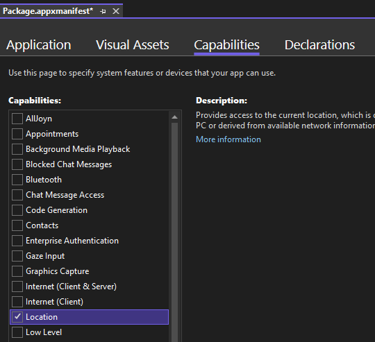

# GeolocatorService

[](LICENSE)  

A service to get the user's current location, based on Geolocator, suited to WinUI, UWP or [Uno](https://platform.uno/) apps.

GeolocatorService aims to simplify getting the user's current location and handling most common scenarios, including getting the permission to obtain this location and handling cases where this permission is denied.

## Getting Started

1. ### Add Package

   #### .Net Mobile / WinUI
   
   Add the GeolocatorService.Uno.WinUI nuget package to your project heads.
      
   #### Xamarin / UWP
   Add the GeolocatorService nuget package to your project heads.
   
   ### Reactive Extensions
   To have access to reactive extensions such as `GetAndObserveLocation`, add the `GeolocatorService.Reactive` nuget package to your project.

1. ### Add the relevant permissions

   #### Windows
   
   Add the Location capability in your manifest.

   ``` xml
    <!-- Package.appxmanifest -->
    <Package ...>
        <!-- (...) -->
        <Capabilities>
            <DeviceCapability Name="location"/>
        </Capabilities>
    </Package>
   ```
    <details>
        <summary>Visual Studio appxmanisfest UI</summary>

    
    </details>
   
   #### iOS
   
   Include the `NSLocationWhenInUsageDescription` and `NSLocationUsageDescription` entries in your info.plist file. These values define the message shown to users when they are asked for location permission. For instance,
   
   ``` xml
    <!-- info.plist -->
    <key>NSLocationWhenInUseUsageDescription</key>
    <string>TODO NSLocationWhenInUsageDescription</string>
    <key>NSLocationUsageDescription</key>
    <string>TODO NSLocationUsageDescription</string>
   ```
   
   #### Android
   
   Add the location permission to your AssemblyInfo.cs file.
   
   ``` cs
    // AssemblyInfo.cs
    [assembly: UsesPermission(Android.Manifest.Permission.AccessFineLocation)]
   ```

1. ### Instantiate GeolocatorService

   Add GeoLocatorService :

   ``` csharp
   var locationService = new GeoLocatorService();
   ```

1. ### Request permission

   After you have added the relevant location permission info to your project configuration, locate the spot in your code where you want to ask the user for their location permission. This [iOS guidelines](https://developer.apple.com/design/human-interface-guidelines/ios/app-architecture/requesting-permission/) or this [Android guidelines](https://developer.android.com/training/permissions/requesting) may help you decide. This must be done before accessing their location. Add the following line to do so:
   
   ``` cs
   var isGranted = await locationService.RequestPermission(CancellationToken.None);
   ```

1. ### Request User location

   If permission is granted, you are able to invoke the `GetLocation` function to obtain the user's current location.

   ```csharp
   Geocoordinate location = await locationService.GetLocation(CancellationToken.None);
   ```

## Features

### Request Permission

``` cs
   var isGranted = await locationService.RequestPermission(CancellationToken.None);
```

You may safely request the permission multiple times; the user will only get prompted as often as is necessary.

For instance, if you ask the user for their permission once and they decline, calling `RequestPermission` again will not prompt the user again, but simply return `false`.

If the user answers "Allow once", then calling `RequestPermission` again during the lifetime of the app will simply return `true`. Once the app is restarted, calling `RequestPermission` will prompt them for the permission once again, since their original permission has now expired.

Once permission is requested, you can use the various methods and extension methods of IGeolocatorService.

### Request the user's location

Once you have obtained the location permission, it's a simple matter to obtain the location:

``` cs
if (isGranted)
{
    location = await locationService.GetLocation(CancellationToken.None);
}
//or
var locationOrDefault = await locationService.GetLocationOrDefault(CancellationToken.None);
```

When using `GetLocation`, if the user has not granted the location permission, an `InvalidOperationException` is thrown; therefore, we recommend not calling this method if you know the user has denied the location permission and this is a normal scenario. 

In cases you are not sure of the permission status, we suggest employing the extension method named `GetLocationOrDefault` instead. This method will return null instead of throwing an exception, in case the permission was denied.

### React to changes in the user's location or their permissions

`IGeolocatorService` offers events to allow you to react when the user's location has changed, or when they have granted or denied permissions. Even if these changes occur while the app is in background, they will be raised when the app comes back to the foreground.

``` cs
locationService.LocationChanged += OnLocationChanged;
locationService.LocationPermissionChanged += OnLocationPermissionChanged;
```

### Track the location and permission using Reactive Extensions

GeolocatorService.Reactive adds a few extension methods which will allow your app to fluidly keep track of the user's location and permission status.

For instance, let's say your app wants to display relevant information to the user's location when it's available, and a completely different type of information when that location is unavailable (because the permission was denied or the device is unable to provide a location).

``` cs
IObservable<PageContent> content = locationService.GetAndObserveLocationOrDefault(ct)
    .Select(location =>
    {
        if (location == null)
        {
            // TODO Gets information which is independent of the location
        }
        else
        {
            // TODO Gets information pertinent to the location
        }
    });
```

### Geocoordinate

Please note that the value generated from a user's location depends on the capabilities of the platform. Not all devices can provide information such as `Altitude`, `Heading` (direction), and `Speed`.

Geocoordinates offer details about the `Accuracy` of the data. Additionally, you can access the source of the data through `PositionSource`. This information can help you evaluate the precision of the collected data.

## Breaking Changes

Please consult the [BREAKING CHANGES](BREAKING_CHANGES.md) for more information about breaking changes
history.

## Changelog

Please consult the [CHANGELOG](CHANGELOG.md) for more information about version
history.

## License

This project is licensed under the Apache 2.0 license - see the
[LICENSE](LICENSE) file for details.

## Contributing

Please read [CONTRIBUTING.md](CONTRIBUTING.md) for details on the process for
contributing to this project.

Be mindful of our [Code of Conduct](CODE_OF_CONDUCT.md).
